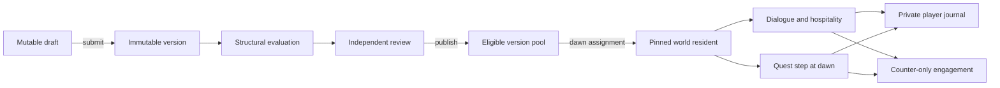

# Community NPC prototype

Issue 18 replaces the fixed Bar roster with versioned, UUID-addressed NPCs that creators can author, reviewers can publish, and tavern saves can receive and progress independently. This is a local prototype. Reset the local Supabase database when the schema changes; there is no hosted or production migration target.

## Runtime model

An NPC identity owns a sequence of immutable versions. A creator edits one draft at a time, and submission freezes that draft into a version. Review publication makes the version eligible for future world assignments. Existing residents remain pinned to the exact version assigned when they arrived.

Each tavern save begins with UUID-backed Lira Nightwind and Torvin Ashbeard. The current capacity is `communityNpcLevel + 1`, with a minimum of two. Dawn resolves one eligible step for every active resident, applies all same-dawn level gains, and then admits at most one eligible community NPC. The arrival receipt stores the candidate count, draw, selected identity, and version so a retry cannot resample.

The Bar opens with `npc_bar_summary()`, a bounded projection containing save state, offerings, recent hospitality, recent news, and the latest arrival. `npc_roster()` returns at most 20 resident cards with cursor and name search. The selected journal is loaded separately through `npc_journals()`. Dialogue and hospitality address stable NPC and world-instance UUIDs; no active application contract accepts `lira`/`torvin` string keys.



## Authoring and review

`/authoring/npcs` is available to users with `npc_author`. The guided editor covers identity, appearance, personality, named relationships, lore, knowledge and disclosure rules, skills, and a two-to-ten-milestone campaign. It keeps stable internal references while creators work with names and structured controls. Autosave sends the expected draft revision after a debounce. A stale write returns a visible conflict and freezes editing until the creator reloads; two browser tabs never merge silently.

Field assistance and sandbox conversations use the configured server-side authoring provider. OpenAI Responses calls use strict structured outputs, the complete draft sheet, and the ordered sandbox transcript. Assistance presents separate Current and Suggested cards and changes the draft only after the creator accepts it. A no-change response is reported as such. Provider absence, invalid output, and timeouts produce explicit recoverable states rather than placeholder prose.

Sandbox sessions freeze their source revision, persist ordered turns, and survive reloads. Saving or accepting an assistance proposal invalidates the active session while preserving its transcript in history.

Artwork authoring has two independent requirements. **Character sprites** has one required Neutral slot and optional Happy, Sad, Angry, Engaged, and Leaving slots. An optional runtime slot falls back to the selected Neutral asset; it never invents a replacement image. For one slot at a time, an author may upload one transparent PNG or request one to four locked-style AI alternatives. Both routes create candidates that require explicit selection and travel through the same review, versioning, moderation, and deletion lifecycle. The server validates decoded PNG pixels, contains accepted uploads in a transparent `1024 × 1536` canvas with an eight-pixel perimeter, stores a private PNG master and alpha-preserving WebP derivative, and never gives a browser a storage credential or object key. Selecting a new Neutral atomically clears optional selections. Candidates made against the former Neutral remain visible as stale until the author explicitly confirms them against the new anchor. Editing visual fields invalidates sprite selections; lore and campaign edits preserve them. **Choose their setting** selects one of three immutable, environment-only library entries. It replaces prompt-based scene discovery and continues to pin the chosen asset through `selected_scene_asset_id`.

Provider outages, rejected images, malformed or opaque output, storage failures, and partially successful batches remain visible as real states. They never produce fixture portraits or placeholder successes. Submission requires both a current validated portrait and a verified curated setting, then runs the shared sheet validator and records structural evaluation evidence. History renders version changes, evaluation results, both pinned assets, reviewer decisions, comments, and retirement status in readable panels.

Reviewers use `/admin/npcs`. They see frozen submitted content, structural evaluation evidence, linked comments, report evidence, and appeals. Ownership history prevents a current or former owner from reviewing or moderating a community identity. The local seed administrator may review its own first-party Lira and Torvin successor versions so one pilot account can exercise the complete prototype workflow; this exception does not apply to community-authored identities. Publishing, requesting changes, rejecting, retiring, pausing, quarantining, and banning are audited server operations.

The prototype uses capability checks in database functions and SvelteKit server actions. Browser clients have no direct access to private authoring, narrative, evaluation, report, or audit tables.

## Player privacy and control

Community attribution links an encountered NPC to a public creator profile containing only the creator's display name, bio, join date, and active or retired published NPCs.

A player may dismiss a community resident. The NPC leaves the active roster permanently, its identity receives a no-return tombstone for that save, and its journal remains in the player's read-only archive.

A report applies to the exact pinned version and stores a frozen copy of its metadata plus the reporting world's complete visible transcript. The UI warns about that attachment before submission. One player world can contribute only one threshold-counting report per version. Three distinct-world reports pause new sampling. Review decisions appear in the reporter's inbox; the creator receives a sanitized reason without reporter identity.

A player may also create a permanent conversation share for the NPC's creator. The UI first shows the exact transcript and an irreversible, no-revocation warning. Sharing is anonymous unless the player explicitly includes a snapshot of their public display name. Shared transcripts are separate from analytics.

Mature community content is disabled by default. Enabling it requires an adult attestation and explicit confirmation. Disabling it calls one database operation that updates the setting and removes mature residents, their player-visible narrative, and shares while retaining restricted tombstones and moderation/accounting evidence.

## Analytics

Runtime triggers record only allow-listed counter events: assignment, active presence, dialogue, day present, hospitality, milestone outcome, campaign completion, dismissal, and report. Each event has a deterministic source key, so retries cannot increase counts. Events store a one-way world hash and bounded non-narrative metadata. Raw dialogue, memories, player timelines, and player identifiers are unavailable through creator analytics.

The service-only daily rollup rewrites one UTC date idempotently into `npc_daily_analytics`. `/authoring/npcs` shows the owning creator counts and rates from the first assignment without a cohort threshold or ranking.

## Local media and fixtures

All portrait source references, manual expression-sprite masters, and generated image bytes stay outside Git. Install the seven approved style references under:

```text
.local/media/source-masters/community-npcs/style-references/brac-character-look-v1/
```

If a developer wants reusable local manual-upload inputs, place them under their NPC and expression slot:

```text
.local/media/source-masters/community-npcs/expression-sprites/<npc-id>/<neutral|happy|sad|angry|engaged|leaving>.png
```

This is an optional convenience directory, not a seed requirement. The Creator Studio is the only supported way to promote one of these bytes into a private candidate: choose the matching slot, upload exactly one PNG, inspect the normalized candidate, and select it explicitly. The fixture command never discovers or uploads these source masters on an author’s behalf, because doing so would bypass the author, ownership, and Neutral-anchor checks.

Install the approved tavern source under:

```text
.local/media/source-masters/community-npcs/settings/CozyTavernBackground.png
```

The fixture derives the three `1600 × 900` setting WebPs under:

```text
.local/media/runtime-derivatives/community-npcs/settings/
```

These directories are ignored by Git. The private references are loaded only by server code and are never included in browser data. The three setting derivatives are uploaded to local Supabase Storage, read back, hash-verified, and registered as the shared setting library. Expression uploads store their PNG master in the private `community-npc-portrait-masters` bucket and their WebP runtime derivative in the private `community-npc-portraits` bucket. `npm run fixtures:users:local` creates and verifies both buckets even when no source art exists, so a fresh checkout has a functional Creator Studio with clear empty-state guidance.

Do not add source PNGs, generated portrait masters, runtime WebPs, TIFF, PSD, XCF, or KRA files to the repository. The fixture only creates records and Storage configuration from disposable local state; it never fabricates a portrait, uploads a manual source, or calls a billable image provider.

Run:

```sh
npm run fixtures:users:local
```

The fixture command provisions the two pilot users, uploads and registers the setting library, and reports missing local media without inventing it. It assigns Lira Nightwind and Torvin Ashbeard to `keeper.one@example.test` and creates editable successor drafts copied from their current published versions. Their published versions remain unchanged. Keeper one is the local administrator and can approve changes to those first-party identities; keeper two remains available for independent-review testing.

Portrait generation uses `NPC_IMAGE_API_KEY` when configured, otherwise the existing server-only `OPENAI_API_KEY`. `NPC_IMAGE_PROVIDER`, `NPC_IMAGE_MODEL`, and `NPC_IMAGE_DEADLINE_MS` control the adapter. Neutral must be selected before an optional expression can be uploaded, generated, or selected. AI optional-expression alternatives are anchored to the selected Neutral asset; a later Neutral change clears their selections and requires an explicit stale-anchor confirmation before reuse. Normal fixtures and automated tests do not make billable image requests.

Candidate previews are short-lived, authorization-checked URLs. An author can discard only an unselected, unpinned candidate in an editable draft. Submitted versions freeze the complete selected slot map, provenance, anchors, and Neutral fallback resolution. Quarantine, takedown, retirement, and purge retain governance-safe hashes and audit records while removing the private master and runtime derivative through the existing deletion worker.

For explicit scale testing against the disposable local database:

```sh
FIXTURE_NPC_SCALE=1 npm run fixtures:users:local
```

This creates a 1,000-identity candidate pool and assigns 100 residents to one save so roster pagination, search, and set-based dawn behavior can be measured. It is excluded from normal startup.

## Verification

The community-specific database suites are:

- `supabase/tests/community_npc_platform.test.sql`
- `supabase/tests/community_npc_runtime.test.sql`
- `supabase/tests/community_npc_authoring.test.sql`
- `supabase/tests/community_npc_authoring_experience.test.sql`
- `supabase/tests/community_npc_portrait_assets.test.sql`
- `supabase/tests/community_npc_bar_scaling.test.sql`
- `supabase/tests/community_npc_purge.test.sql`
- `supabase/tests/community_npc_engagement.test.sql`

Use the standard repository checks after a local reset:

```sh
npm run db:reset:local
npm run db:types:check
npm run test:db
npm run test:unit
npm run test:integration
npm run check
npm run build
npm run secrets:audit
npm run media:git:check
```

The deterministic local evaluation is part of submission. `npm run npc:eval:live` remains an explicit, billable OpenAI dialogue evaluation and requires `OPENAI_API_KEY` in the ignored root `.env`.
