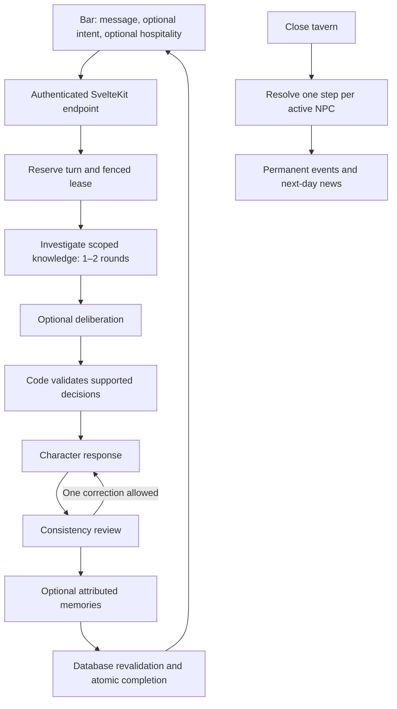

# NPC dialogue MVP: technical specification

Implemented for Lira Nightwind and Torvin Ashbeard in SvelteKit + Supabase. This document consolidates the approved dialogue plan and the delivered contracts. Every turn has text plus two independent optional choices: a player-selected intent card and a food or drink offering. Each NPC keeps their own transcript, intentions, attributed memories and permanent history.

## Runtime boundaries



The diagram's correction edge runs at most once. Day advancement never invokes a model. All provider work happens outside database transactions. SvelteKit derives the actor from `getVerifiedUser()`; request bodies cannot choose a save or player. Supabase's service-role credential is used only inside server modules. Authenticated players cannot read the narrative schema, inspect raw processing records, or call generation/checkpoint/completion RPCs.

The legacy patron catalog retains historical prices and receipts but has no direct player SELECT grant. Owned snapshot functions project only the public/current story fields. `get_tavern_snapshot()` and `get_bar_snapshot()` run with a fixed empty search path and explicitly filter the caller's save.

## Public and internal contracts

`POST /api/dialogue` accepts:

```json
{
  "turnId": "client-generated UUID",
  "patronKey": "lira",
  "message": "How is the quest going?",
  "expectedConversationSequence": 0,
  "interactionVersion": "dialogue-v2",
  "intentCardId": null,
  "offering": { "kind": "beverage", "itemId": "owned-item UUID" }
}
```

Messages contain 1–2,000 characters. `intentCardId` and `offering` may each be null; neither requires the other. The complete input is frozen under the turn ID; changing any field on retry is a conflict. Responses are either `{status:"processing",turnId}` or `{status:"completed",result}`. The completed result includes reply, sequence, relationship, total relationship change, the played intent card, optional hospitality receipt, optional accepted intention and committed save revision.

`GET /api/dialogue/:turnId` returns owned status, frozen input, any saved result, a sanitized error code and `canRetry`. `DELETE` cancels unfinished work and replaces its fence. Mutation endpoints require the same origin. Responses with game data use `private, no-store` caching.

The application service alone calls `dialogue_begin`, `dialogue_context`, `dialogue_checkpoint` and `dialogue_complete`. The browser uses the status endpoint and `get_npc_journal` projection. The latter exposes availability, current intention/step, qualitative risk, preparation, authored loss warning, the last 40 completed exchanges and recent visible events.

## Records and authority

| Record | Authority and visibility |
| --- | --- |
| `private.npc_content_versions` | Immutable authored sheets keyed by character + version; never sent whole to the browser or model. |
| `private.npc_content` | Current-version selector and checked sheet copy used when initializing a character. |
| `private.npc_lives` | Save-specific availability and conversation sequence. |
| `private.npc_quests` | Goal, motivation, targets, ordered steps, preparation and terminal state; frozen content/rule versions. |
| `private.npc_events` | Committed game facts, random draws and probabilities; only designated news is shared. |
| `private.npc_retired_targets` | Lost/finished opportunity targets and their source quest; blocks mechanical reuse. |
| `public.dialogue_turns` | Server-only input, lease/fence, checkpoints, cumulative calls, error and exact final receipt. |
| `private.npc_attempts` | One record per fenced processing attempt, including call count, terminal status and finish time. |
| `private.npc_memories` | Attributed statements/claims/promises/interactions with exact source quote and turn FK. |
| `private.npc_reactions` | Daily subject deduplication and relationship-change accounting. |
| `private.npc_usage` | Per-player UTC-day attempt and call counters. |
| `public.intent_cards` / `public.intent_card_plays` | Versioned player-selected dialogue framing and its one-use ledger. |
| `public.hospitality_events` | Canonical food/drink receipt and consumption ledger shared by dialogue and standalone serving. |

Content-version foreign keys make historical sheets resolvable. Existing characters stay pinned when new content is published. A memory never updates a quest, content sheet, event or character availability. The keeper's claim remains a claim even if it asserts success. Memory summaries with invalid source quotes or system-style person references are discarded.

## Investigation and decisions

Baseline context includes compact identity/voice/personality, current relationship and intention, allowed entity targets, original message, the player-selected intent, proposed hospitality and up to six completed exchanges. It is checkpointed so a retry uses the same evidence. Intent tells the model how the keeper means to frame the words; it cannot compel agreement or create a game effect by itself.

The investigation function schema permits only `quests`, `history`, `relationships`, `memories` and `news`, with at most three requests per round and 200-character queries. The second round can follow a reference discovered in the first. SQL scopes every result to the actor's save and character, applies authored trust disclosure thresholds, and shares another character's events only when designated public and already in a prior tavern day.

Memories use PostgreSQL English text search with entity references, rule-derived importance and recency ranking; investigation queries and returned source IDs/content versions are persisted with bounded evidence snapshots. Empty results never authorize new facts. Context version `npc-context-v1` fits whole exchanges and tool results into a 30,000-character window, reserving space within a hard 40,000-character JSON payload limit for decisions, replies and review findings. The original message, personality, current intention and immediately preceding exchange are mandatory and never truncated. Older exchanges are removed before retrieved evidence; omitted-record counts accompany the retained context. Oversized mandatory context stops before another provider call and commits no effects. Embeddings are deferred.

Consequential turns add deliberation. Its strict proposal describes stance (`agree`, `refuse`, `clarify`, `respond`), signed reaction, subject, exact quoted evidence and optional intention. Code removes unsupported plans and switches to clarification before speech. The decision checkpoint saves the exact context window used for deliberation; speech, review, rewriting and retries reuse it. Each stage records its actual payload size, source IDs, recent exchange IDs and a canonical context digest that remains stable through PostgreSQL JSONB storage. Plans have 1–3 ordered steps, known available targets, supported actions (`prepare`, `attempt`, `wait`, `abandon`) and approaches (`scouting`, `combat`, `diplomacy`, `trade`). Only their final step can attempt or abandon; all preceding steps prepare or wait. Attempts and abandonment end the objective, so later steps would be unreachable. Application validation, authored-content validation and a database constraint enforce this order.

Changing an active goal creates a successor and records abandoned history. A completed or failed goal remains terminal. A later unrelated goal may use remaining known targets; retired opportunity targets remain unavailable. NPC loss cannot be introduced by a generated goal. Free-form goal semantics still depend on model interpretation/review; the database controls which quest instances and entities can mechanically change.

The writer receives the validated decision and `effectiveIntention`, which resolves an accepted change over the older plan still present in historical context. The reviewer uses the same precedence. Rewrite findings cannot change this decision. The writer cannot authorize effects. The reviewer checks factual support, disclosures, promise ownership, commitments, hospitality and timing. It can request one rewrite. Two failed reviews stop the turn without effects. This reduces errors but does not guarantee that every line of prose is factually perfect.

## Social and hospitality rules

A meaningful positive or negative reaction applies +2 or −2. The same subject (`quest`, `personal`, `hospitality`) cannot score repeatedly for the same NPC/day. Positive and negative totals are separately capped at four per day. Routine praise earns no effect. Memories can persist after a scoring cap is reached. There is no model action that verifies fulfillment/betrayal or converts a claimed outcome into canon.

Server context supplies the selected intent separately from a food/drink preview. The preview contains item type, name, quality, payment and relationship effect. Completion calls the same private hospitality helper used by standalone service. Item uniqueness comes from `hospitality_events`; intent uniqueness comes from `intent_card_plays`. The reply, intent play, hospitality receipt, payment, item consumption, relationship, accepted intention, sequence and memories commit together. A failed, cancelled or stale turn consumes nothing.

Quality-specific prices are preserved. Historical Pour Ale rewards remain labeled legacy entitlements, can be used only with standalone drink service, and retain their stored multipliers/bonuses. New crafts issue intent cards instead. Subsequent hospitality changes trust and overnight readiness, while legacy chapter progress remains historical. The result's `relationshipChange` already includes hospitality and dialogue effects; consumers must not add the hospitality delta again.

## Overnight rules and permanent consequences

Closing is allowed without crafting. An active brew or unexpired processing conversation blocks closure; failed/expired turns do not. One eligible step resolves per present NPC, including characters the keeper did not speak to.

- Preparation adds one, capped at two. Wait moves to the next step.
- Attempt chance is `clamp(10,90,50 + 10*(skill-difficulty) + 10*preparation + 5*hospitality)`.
- Authored skills/difficulty are 0–4. Hospitality is the day's summed `(qualityIndex-3)` from served food and drinks, clamped −3..3. Intent cards do not alter this modifier.
- The draw is an integer 0–99; success means draw < chance. The draw, probability and outcome are saved once and replayed exactly.
- Attempts finish the objective, whether successful or failed. There is no automatic retry of a terminal quest.
- A failed authored combat attempt with zero preparation and draw >=95 may kill Lira or permanently remove Torvin, according to that version's warning/loss definition. The journal warns before the step. New generated goals have no character-loss authority.
- Only authored success/failure outcomes are designated public news. Preparation, private negotiations and generated objectives remain private to the character. The keeper can inspect both journals.

The journal uses low risk at >=70%, moderate at >=45%, otherwise high. It never exposes exact odds. Authored failure text closes the bandit-camp opportunity or Oren's heartstone deal. Retired targets and terminal availability survive subsequent days and goal changes.

## Recovery, budgets and provider

`dialogue_begin` locks the owned save, checks sequence/day/revision/inventory and creates a 120-second lease. One live generation per save is allowed. Retries of completed input return the exact receipt; an active lease returns processing. Expired/failed work gets a fresh fence and resumes safe checkpoints. A rejected rewrite or oversized mandatory context cannot be resumed; the keeper must cancel and rephrase. Exhausted turns cannot request another model call, but a fully checkpointed turn can still retry completion with zero new calls. Calls already reserved still count, including uncertain provider requests.

The application deadline covers provider and database requests, defaults to 90 seconds and is capped below the database lease. Failure recording gets a separate best-effort one-second cleanup window. Default limits are two investigation rounds, one rewrite/recheck and eight calls across the turn's attempts. `.env` can reduce application call/round/deadline limits. Trusted database configuration in `private.npc_rules` controls six new turns/minute, 100 processing attempts/UTC day and 400 calls/UTC day. Attempts and call reservations serialize through the save lock.

Completion rechecks the captured revision, day, sequence, lease/fence and availability before any effect. A competing pour can invalidate a generated reply. Cancellation/expiry/day-end terminalizes processing records. The UI allows cancellation during generation, waits for database confirmation before releasing its frozen command, and ignores late browser responses. If completion won the race, cancellation returns the saved reply and the UI reports it as saved. An unconfirmed cancellation keeps Check reply and cancellation available. If the begin response is lost before its fence is known, the application cannot safely mark that reservation failed: status/cancel or the 120-second lease recovers it without any provider call or game effect. Day-end receipts are available only to the owning keeper, who may inspect both journals; other NPCs receive only their own events and designated public news through investigation. A timeout after an uncertain provider execution may cause another provider charge on retry; only the committed game effects are guaranteed once.

OpenAI uses the Responses API: investigation is a strict controlled function call, other model stages use strict JSON-schema output, with application validation afterward. Defaults are `gpt-5.6-luna` for investigation/review/memory and `gpt-5.6-terra` for deliberation/speech. Requests set `store:false` and low/disabled reasoning by stage. Selecting `NPC_PROVIDER=local` always returns an explicit unimplemented error; it never calls OpenAI or supplies canned dialogue.

References: [function calling](https://developers.openai.com/api/docs/guides/function-calling), [structured outputs](https://developers.openai.com/api/docs/guides/structured-outputs), [Luna](https://developers.openai.com/api/docs/models/gpt-5.6-luna), [Terra](https://developers.openai.com/api/docs/models/gpt-5.6-terra).

## Implementation and verification map

- Content: `supabase/content/npcs.json`, `scripts/npc-content.ts`.
- Contracts/orchestration: `src/lib/game/dialogue.ts`, `src/lib/server/dialogue/`.
- Persistence/rules: the base dialogue migrations plus additive `202609080013_intent_hospitality_v2.sql`, `202609080014_dialogue_interaction_v2.sql` and the idempotency correction in `202609080015_intent_hospitality_corrections.sql`.
- Interface: `/bar`, `/api/dialogue`, `/api/dialogue/[turnId]`.
- Deterministic verification: `supabase/tests/npc_dialogue.test.sql`, `tests/integration/dialogue-rpc.test.ts`, `tests/unit/dialogue.test.ts`, `tests/e2e/dialogue-journey.test.ts`.
- Live evaluation and review rubric: [evaluation cases](evaluations/npc-dialogue.md).
- Operations and authoring: [development runbook](development.md).

Cooking, renewable gardening, embeddings and the local inference adapter remain outside this dialogue MVP.
