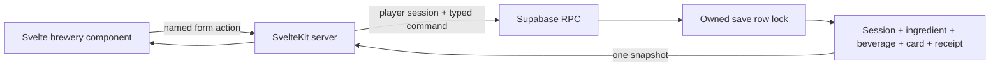

# Brewery vertical slice implementation record

Status: implemented and verified locally on 2026-09-07. Hosted deployment remains a later step.

This slice extends the garden plan with one connected path:

> harvest an ingredient → select it in the brewery → stir for 30 seconds → bottle a quality-scored beverage → earn a social card → start the next tavern day

## Product trace

The [Product Design Document](</home/hosm/Projects/braindump/Specifications/Cozy Tavern/Product Design Document.md:25>) calls for one tavern minigame per in-game day, a 30-second mead-stirring activity with a red/yellow/green sweet-spot bar, ingredient-dependent beverage quality, and social-card rewards. The supplied [prototype brewery](</home/hosm/Downloads/Tavern Simulator Prototype/src/components/BreweryView.tsx:1>) supplies the interaction precedent: 42–58 is perfect, 30–70 is good, and seven named beverage outcomes span the shared Repugnant-to-Resplendent scale.

The product document defines intent; the prototype supplies UI and balancing precedent. The database migration freezes this pilot's concrete formula and rewards so a later balance change can be introduced deliberately.

## Delivered behavior

- `/brewery` is a protected, responsive SvelteKit route with ingredient selection, elapsed-time progress, pointer/touch cauldron input, a keyboard-operable range control, live speed feedback, result display, cellar history, and next-day transition.
- Starting a brew snapshots the selected batch's ingredient quality and brew bonus. One session may exist for each `(save, day)`.
- Completion is rejected before 30 seconds. The client submits bounded counts sampled every 250 ms; missing samples contribute no stirring score.
- The canonical database score is `round(6 × min(120, perfect + good × 0.5) / 120)`. Final quality is the rounded mean of ingredient quality and stirring score, plus one when the snapshotted brew bonus is at least four, clamped to 0–6.
- Completion consumes exactly one available ingredient unit and retains the batch as provenance. Exhausted batches disappear from the available pantry snapshot.
- Potable/Decent creates a fine Pour Ale card (`relationship +5`, `gold ×1.20`), Great creates superior (`+7`, `×1.50`), and Legendary/Resplendent creates exceptional (`+10`, `×2.00`). Lower results create no card.
- A completed craft closes the current day. The explicit day command increments `current_day`, reopens the daily craft, and preserves beverage and card history.

## Architecture and trust boundary

The browser owns input animation, the transient sample counts, stable retry action IDs, and pending/error presentation. Postgres owns eligibility, duration, one-per-day enforcement, ingredient availability, scoring, rewards, revision ordering, and exact-once receipts. Every command derives identity from `auth.uid()` and hides foreign resources behind the same not-found result.

Authenticated players may read only rows belonging to their save. They have no direct write privilege on sessions, ingredients, beverages, cards, saves, or action receipts. `start_brew`, `complete_brew`, and `advance_tavern_day` are the only player craft mutations. The local `service_role` has explicit administrative table privileges for disposable fixtures and maintenance and never enters the SvelteKit runtime or browser bundle.

## Consistency and recovery

All three craft commands lock the save, inspect an existing action receipt before checking the now-changed revision, then commit their state and receipt together. An identical retry returns the stored result. Reusing an action ID with changed input conflicts. Different commands based on one revision serialize so only one can commit.

The UI retains an unresolved start, completion, or day-transition command after an unexpected transport error and resubmits the same ID and payload. Reloading fetches the database snapshot. An active session timer survives reload because its start time is durable; prior client sample counts do not, which intentionally penalizes interrupted stirring in this pilot.

## Verification evidence

- `supabase/tests/brewery.test.sql`: 58 pgTAP assertions for schema constraints, time enforcement, score/name thresholds, consumption, provenance, rewards, day transitions, exact replay, changed-input conflict, RLS, grants, foreign ownership, and invalid telemetry.
- `tests/integration/brewery-rpc.test.ts`: real Auth clients prove parallel identical replay, competing-command serialization, service-backed elapsed-time setup, reward persistence, day advancement, isolation, and denied direct writes.
- `tests/e2e/garden-journey.test.ts`: desktop and mobile Chromium run the connected harvest-to-brew path, verify the reduced pantry quantity, reload the beverage/card, and open day two.
- `npm run check`, `npm run db:types:check`, and `npm run build` verify the Svelte/TypeScript contract and generated Supabase schema types.

See the [local MVP runbook](../development.md) for setup, commands, screenshots, and the reproducible demonstration.

## Next boundary

The [patron serving slice](patron-serving-vertical-slice.md) now consumes a persisted beverage and optional card and atomically persists payment, relationship changes, and draft story progression. NPC dialogue, LLM orchestration, complete authored story arcs, deck loadouts, and broader day simulation still need their own contracts and acceptance paths.
