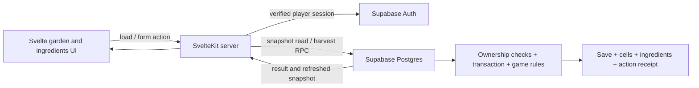

# Garden harvest: SvelteKit + Supabase implementation plan

Status: implemented locally on 2026-09-07. The application, database migration, generated types, fixtures, tests, screenshots, and runbook described by this plan are present in this repository. Hosted deployment remains a later step.

Build one complete path: **sign in → start a tavern → inspect a hex garden → harvest a mature crop → receive ingredients → retain both changes after navigation, reload, and sign-in on another browser**.

This is the garden-to-ingredient slice recommended in the architecture review. It proves the frontend/backend boundary and durable game state. It does not yet validate the primary NPC conversation loop or deliver the full gardening simulation.

## 1. Source requirements and interpretation

The destination repository is `/home/hosm/Projects/ByRookAndCrook`. At planning time it contains a README and repository configuration, with no application scaffold. Treat all implementation paths and commands below as planned deliverables.

The supplied prototype path was duplicated in the request. Use the existing folder `/home/hosm/Downloads/Tavern Simulator Prototype`.

| Source | Evidence | Consequence for this slice |
| --- | --- | --- |
| [Product Design Document](</home/hosm/Projects/braindump/Specifications/Cozy Tavern/Product Design Document.md:1>) | The game is a SvelteKit + Supabase web app. | Scaffold the intended stack in the destination repository. |
| [Gardening requirements](</home/hosm/Projects/braindump/Specifications/Cozy Tavern/Product Design Document.md:17>) | Overhead hex garden, plant care, beehive output bonuses, and later soil/light/companion mechanics. | Implement the hex garden and a small, explicit beehive yield rule. Defer simulation and other plant actions. |
| [Ingredient quality](</home/hosm/Projects/braindump/Specifications/Cozy Tavern/Product Design Document.md:30>) and [deck requirements](</home/hosm/Projects/braindump/Specifications/Cozy Tavern/Product Design Document.md:25>) | Garden ingredients affect beverages; food/beverage quality and gardening bonuses affect social cards. | Persist raw ingredients with quality and recipe modifiers for future consumers. |
| [NPC requirements](</home/hosm/Projects/braindump/Specifications/Cozy Tavern/Product Design Document.md:3>) | LLM dialogue and human-authored arcs form the primary loop. | Keep the later ingredient → crafting → NPC progression connection explicit; do not substitute scripted dialogue for an implemented LLM service. |
| [Prototype garden](</home/hosm/Downloads/Tavern Simulator Prototype/src/components/GardenView.tsx:17>) | Seven plant types, a 3×4 hex layout, crop state, selection, and harvesting. | Reuse the layout, plant identifiers, and interaction vocabulary; port the UI into Svelte. |
| [Prototype ingredient model](</home/hosm/Downloads/Tavern Simulator Prototype/src/game-context.tsx:34>) and [harvest calculation](</home/hosm/Downloads/Tavern Simulator Prototype/src/game-context.tsx:313>) | Ingredients are separate from prepared food/drink, with quality and brew/bake bonuses. | Keep that distinction and use a versioned adaptation of the existing formula. |
| [Prototype theme](</home/hosm/Downloads/Tavern Simulator Prototype/src/index.css:1>) | Tailwind theme, palette, typography, and ornament styles. | Carry over visual tokens and useful CSS; adapt the React root selector and markup. |

The product document is authoritative for product intent. Prototype formulas, starter values, and scaffolding are implementation precedents, not approved balancing requirements. Where the sources are silent, the decisions below are proposed defaults that make this slice executable.

## 2. Scope and completion boundary

Include:

- Supabase email/password sign-in and sign-out for provisioned pilot accounts. Provide two isolated local test accounts through a development-only fixture script. Public registration, recovery, and email delivery are later account-management work.
- An explicit **Start tavern** action for a player without a save. One save per user; repeat submissions return the existing save without reseeding it.
- A responsive garden view, cell selection, crop details, maturity and quality information, adjacent-beehive yield preview, and a Harvest button.
- A separate **Ingredients** route showing persisted ingredient batches, quantities, quality, and recipe modifiers. This also provides a real navigation-away-and-back test.
- Server-authorized, atomic harvesting; repeat-request handling; stale-state and connection-error recovery.
- A reproducible local Supabase setup, migrations, seed content, generated database types, targeted tests, and a runbook.

Defer planting, moving, removal, watering, fertilizing, growth/day advancement, NPK, soil quality, over/under watering, light/shade effects, companion effects, honey collection, crafting minigames, social cards, NPCs, LLM integration, offline play, Realtime subscriptions, and importing prototype local saves. Do not render enabled controls or simulated metrics for these deferred systems.

The demo has a finite set of starter crops. After harvesting them, empty plots remain empty. Repeating the local demonstration uses a documented local database reset; normal visits and sign-ins must never regenerate crops.

## 3. Proposed gameplay rules and starter state

| Decision | Slice default | Basis |
| --- | --- | --- |
| Starter layout | Copy the prototype's 12 cell coordinates, crop identifiers, health/water values, and hive at `c2`. Use fresh database UUIDs and retain `c0`…`c11` as layout keys. | Prototype precedent. |
| Demonstration adjustment | Start fennel at `c1` at growth stage 3 instead of the prototype's stage 2. All other initial cells keep their prototype values. | Proposed change so a player can exercise adjacent-hive harvesting immediately. |
| Maturity | Only a plant at stage 3 is harvestable. An empty cell, hive, or immature plant is rejected by the backend. | Prototype labels describe mature harvesting, although its handler currently accepts any plant. |
| Ingredient quality | `clamp(growth_stage + health_bonus, 0, 6)`, where health bonus is 2 at health ≥80, 1 at health ≥50, otherwise 0. | Equivalent to the prototype formula for its integer stages 0–3. |
| Quality labels | 0 Repugnant, 1 Awful, 2 Potable, 3 Decent, 4 Great, 5 Legendary, 6 Resplendent. | PDD beverage labels; applying this scale to ingredients follows the prototype. |
| Yield | One unit, plus one unit if at least one hive is exactly one hex away. Multiple hives do not stack in this slice. | PDD requires an output bonus; quantity and stacking are proposed balancing defaults. |
| Recipe modifiers | Preserve the prototype plant bonus table. Multiply each base brew/bake bonus by 2 for quality ≥4, by 1 for quality ≥2, otherwise by 0. These are per-unit modifiers; batch quantity is separate. | Prototype precedent, carried forward for future crafting. |
| Rule/content versions | Store an initial `harvest-v1` rule identifier with the save, ingredient batch, and successful action receipt. Treat the corresponding catalog values as immutable. | Proposed support for reproducible results when balancing changes. |

Use the prototype's rendered coordinate convention: odd rows shift right by half a hex. Derive adjacency from coordinates, for example by converting to axial coordinates with `q = col - (row - (row & 1)) / 2`, `r = row`, then measuring hex distance. The UI and backend must agree on this geometry. The prototype's hard-coded `BEEHIVE_RANGE` includes `c0`, which is two hexes from `c2`; do not carry that set over.

Expected starter examples:

| Harvest | Expected result |
| --- | --- |
| `c0`, mature hops, health 90 | Cell becomes empty; one Legendary hops unit, brew bonus 4 and bake bonus 0. No hive bonus. |
| `c1`, mature fennel, health 85 | Cell becomes empty; one batch containing two Legendary fennel units, each with brew bonus 2 and bake bonus 4. Hive at `c2` supplies the extra unit. |
| `c4`, stage-2 pepper | Rejected as immature; garden and inventory remain unchanged. |

With maturity fixed at stage 3, this formula produces ingredient quality 3–5. Resplendent remains a supported tier for later rules; do not claim this slice can produce every tier. Health/water are saved starter values, not an active simulation. Hive yield affects quantity, not quality.

## 4. Architecture and ownership of state



Use SvelteKit with TypeScript, Tailwind, `@supabase/supabase-js`, and `@supabase/ssr`. Resolve compatible stable versions during scaffolding and commit the lockfile. Replace React/JSX, hooks, and Figma-specific Vite plugins rather than importing the prototype scaffold.

Use a request-scoped Supabase client in `hooks.server.ts`, cookie session refresh, and verified identity via `getClaims()` or `getUser()` before protected server loads/actions. Never authorize from the unvalidated user object returned by `getSession()`. Use the player's session for database calls; runtime gameplay needs no service-role credential. See the official [Supabase SvelteKit integration](https://supabase.com/docs/guides/getting-started/tutorials/with-sveltekit) and [SSR client guidance](https://supabase.com/docs/guides/auth/server-side/creating-a-client).

Use server loads for reads and named SvelteKit form actions for Start tavern, Harvest, and sign-out. Enhance the harvest form for in-place feedback. A GET/load must not create or modify a save. Keep normal same-origin form protections enabled. [SvelteKit form actions](https://svelte.dev/docs/kit/form-actions) support this read/write separation.

Database rows own persistent gameplay state. Svelte component state owns selection, pending indicators, errors, and animations. Server-provided page data supplies the displayed garden and ingredients. Do not introduce a server-global game store or a second durable copy in browser storage. [SvelteKit state guidance](https://svelte.dev/docs/kit/state-management) explains request/component scoping.

Keep TypeScript contracts, labels, and presentation helpers independent of Svelte. For this slice, canonical harvest calculations run inside the database transaction. A read RPC can use the same private SQL helpers for yield/quality previews; the browser displays these previews and does not submit them as authoritative values. Avoid maintaining a second executable harvest formula in TypeScript.

## 5. Database model and access rules

Use migrations to create the following minimal model. Do not add unrelated NPC, deck, economy, or minigame tables yet.

| Table | Key fields and constraints |
| --- | --- |
| `plant_catalog` | Composite key `(rules_version, plant_key)`; name, icon key, base brew/bake modifiers. Seed the seven prototype plants as versioned game content. Player roles have read access only. |
| `tavern_saves` | UUID `id`; unique `user_id` referencing `auth.users`; `rules_version`; monotonically increasing `revision`; timestamps. One save per player. |
| `garden_cells` | UUID `id`; `save_id`; `layout_key`; `col`, `row`; `kind` (`empty`, `plant`, `beehive`); nullable plant key, stage, water, health; rule/catalog reference. Unique `(save_id, layout_key)` and `(save_id, col, row)`. |
| `ingredient_batches` | UUID `id`; `save_id`; catalog reference; `quality_index`; positive `quantity`; per-unit brew/bake modifiers; source cell; source action ID; rules version; creation time. One row per successful harvest, including hive quantity. |
| `game_actions` | Primary key `(save_id, action_id)`; actor ID; command kind; normalized request payload; rules version; immutable result JSON; committed revision; creation time. Successful action receipts support safe retries. |

Enforce stages 0–3, water/health 0–100, quality 0–6, nonnegative modifiers/revision, and positive integer quantities. Use explicit nullability checks: plants require valid catalog and plant-state fields; empty cells have none; hives have no plant key/stage. Clearing a crop preserves cell identity and coordinates. Require composite foreign keys from ingredient `(save_id, source_action_id)` to action `(save_id, action_id)` and ingredient `(save_id, source_cell_id)` to cell `(save_id, id)`, with the corresponding unique cell key. Index save ownership and child `save_id` lookups.

Enable row-level security on all player-state tables. Authenticated reads are restricted to saves where `user_id = auth.uid()` and their children. Anonymous roles get no player-state reads. Revoke direct insert/update/delete access to game tables from player roles; row ownership alone must not allow arbitrary inventory or quality edits. [Supabase RLS documentation](https://supabase.com/docs/guides/database/postgres/row-level-security) covers row access; command functions enforce gameplay invariants.

Expose only `create_tavern()`, `get_tavern_snapshot()`, and `harvest_crop(...)` as the required RPC surface. Use an invoker read function with RLS. The two controlled write functions can use `SECURITY DEFINER` with an empty `search_path`, schema-qualified references, explicit `auth.uid()`/ownership checks, and restricted execute grants. Revoke default PUBLIC/anonymous execution; grant only intended public functions to `authenticated`. Put pure preview/rule helpers in a schema that is not exposed through the Data API, granting authenticated schema usage and execution only for the read-only helpers needed by the invoker snapshot. Those helpers must not elevate privileges or mutate data; mutation-only helpers remain inaccessible to player roles. Validate again inside RPCs because a caller can bypass SvelteKit and invoke the Data API directly. See [Supabase database functions](https://supabase.com/docs/guides/database/functions).

Every write RPC must derive its actor from `auth.uid()` inside SQL, reject null, and check the save against that actor. `create_tavern()` accepts no actor/user ID. `harvest_crop()` writes `game_actions.actor_id` from the derived actor, never a request field. Include helper grants and direct RPC calls in authorization tests.

Keep versioned catalog and starter content in migrations or migration-installed helpers so an empty hosted database receives it too. Reserve local seed/fixture scripts for test identities and scenario variants. A development-only fixture may use a local administrative credential, but it must verify the local target, never enter browser/runtime imports, and never execute against a hosted project.

## 6. Commands, consistency, and recovery

**Create tavern:** the authenticated player explicitly submits Start tavern. In one transaction, use `INSERT ... ON CONFLICT (user_id) DO NOTHING RETURNING id`; provision the 12 cells only if that statement inserted the save. If a concurrent initializer wins, perform a subsequent SQL read after the conflicting insert completes, using a fresh statement snapshot under READ COMMITTED, and return the complete existing save. Do not use a same-statement fallback read that may not see the winning transaction. Never fill existing empty cells or restore harvested crops. A failed initialization rolls back the entire new save. See [PostgreSQL transaction isolation](https://www.postgresql.org/docs/current/transaction-iso.html).

**Read snapshot:** return the current player's save/revision, cells with server-derived harvest previews, and ingredient batches. No save returns an onboarding state; database failure returns a load error, never an invented empty garden. Construct the snapshot in one SQL statement with one consistent read snapshot, avoiding separately fetched garden/inventory versions. Mark personalized responses private/non-cacheable by shared caches.

**Harvest contract** — application types, mapped to RPC parameter names by the server adapter:

```ts
type HarvestCommand = {
  saveId: string;
  cellId: string;
  actionId: string;        // UUID, reused for retries of this exact request
  expectedRevision: number;
};

type HarvestReceipt = {
  actionId: string;
  cellId: string;
  ingredientBatchId: string;
  quantity: number;
  qualityIndex: number;
  brewBonus: number;      // per ingredient unit
  bakeBonus: number;      // per ingredient unit
  committedRevision: number;
  rulesVersion: string;
};
```

Do not accept a user ID, plant identity, health, quality, yield, or modifiers as client-authoritative harvest inputs. Derive identity from authentication and outcomes from saved state.

Execute this sequence in one `harvest_crop` transaction:

1. Validate authentication, UUIDs, integer revision, and save ownership. Lock the owned save row for update. All save mutation functions must follow this same locking convention.
2. Look up `(save_id, action_id)` under that lock. Compare the typed `(save_id, cell_id, expected_revision)` tuple, normalized in SQL; do not compare JSON text or key order. `action_id` is the lookup key, not part of this payload comparison. If the receipt exists and the tuple matches, return its original result. If the ID was reused with different input, reject it. Check replay **before** revision or cell eligibility, since a successful prior attempt already changed both.
3. Reject a new command whose expected revision differs from the current revision. Verify that the cell belongs to this save and is a mature plant.
4. Calculate quality, adjacent-hive yield, and recipe modifiers using saved values and the save's versioned rules.
5. Clear the crop, insert exactly one ingredient batch with the calculated quantity, advance the save revision once, and insert the immutable action receipt. Use deferred references or appropriate insertion order for receipt/batch cross-references.
6. Commit all changes together; any exception rolls all of them back. The receipt plus subsequent snapshot lets the UI acknowledge the action and render current state.

Serializing mutations on the save row is sufficient for this small single-player slice. Two sessions using different action IDs and the same revision cannot both harvest the same crop. Receipt uniqueness is additional protection, not a replacement for transaction locking.

| Outcome | Application behavior |
| --- | --- |
| Success or identical replay | Announce the harvested quantity; reload the authoritative snapshot. A replay does not increment inventory/revision again. |
| Invalid request | Return a safe validation error (400); no mutation. |
| Missing/expired session | Return an authentication error (401); direct the player to sign in, then reload state. |
| Missing or unowned save/cell | Use the same not-found result (404) without exposing another player's data. |
| Stale revision or reused action ID with changed payload | Return conflict (409). Refresh state; a new intentional action receives a new ID. |
| Empty cell, hive, or immature crop | Return ineligible (422); no mutation; refresh the cell display. |
| Lost connection/unknown outcome | Keep the original command and show a retry control. Retry with the same action ID and payload, not a new ID. |
| Commit succeeds but snapshot refresh fails | Preserve the successful receipt and show a refresh failure. Do not present the harvest as rolled back. |

Map explicit database error codes to these application outcomes and sanitize unexpected failures. While a request is pending, prevent another harvest submission in that view. In the current page session, retain unresolved command input for retry. After navigation/reload, discard transient UI state and fetch the database before enabling actions. A lost response must never cause the UI to invent a reward or restore a crop. When overlapping requests finish out of order, do not replace a newer displayed revision with an older snapshot.

## 7. Planned repository structure

All paths in this tree are relative to `/home/hosm/Projects/ByRookAndCrook`.

```text
src/
  app.css
  hooks.server.ts
  app.d.ts
  lib/
    game/contracts.ts                 # Commands, snapshots, receipts, quality labels
    components/garden/                # GardenGrid, GardenCell, CropDetails
    components/ingredients/           # Ingredient inventory UI
    server/supabase.ts                # Request-scoped cookie client support
    server/game.ts                    # Validated RPC adapters and error mapping
    database.types.ts                 # Generated from local migrations
  routes/
    +layout.svelte                    # Global styles
    login/+page.svelte
    login/+page.server.ts             # Password sign-in action
    (game)/+layout.svelte              # Shared navigation and sign-out form
    (game)/garden/+page.svelte
    (game)/garden/+page.server.ts     # Snapshot load; create, harvest, sign-out actions
    (game)/ingredients/+page.svelte
    (game)/ingredients/+page.server.ts # Snapshot load
supabase/
  config.toml
  migrations/                        # Schema, content, functions, policies/grants
  tests/                             # pgTAP invariants and authorization
scripts/
  seed-local-users.ts                 # Two test users; local-only target guard
tests/
  integration/                       # Real concurrent RPC and response-loss tests
  e2e/                               # Browser journey against local Supabase
docs/
  plans/garden-harvest-vertical-slice.md
  development.md                     # Setup, fixtures, checks, demo, deployment notes
.env.example
.github/workflows/ci.yml
```

The shared sign-out form posts to `/garden?/signout`. Its server action calls the request-scoped SSR client's `signOut({ scope: 'local' })`, applies the SDK's cookie deletions through the configured SvelteKit cookie adapter, clears auth-dependent client state, and redirects to `/login`. Handle a sign-out failure explicitly rather than claiming success. Local scope preserves sessions in other browsers. See [Supabase sign-out behavior](https://supabase.com/docs/reference/javascript/auth-signout). Protect every server load/action itself instead of relying only on a parent layout guard. Use a server-capable SvelteKit adapter; deployment host selection can follow later without changing the game RPC contract.

## 8. Implementation sequence and exit criteria

| Step | Work | Depends on | Exit evidence |
| --- | --- | --- | --- |
| 1. Foundation | Scaffold SvelteKit/TypeScript/Tailwind; pin toolchain and package versions; add environment template, request-scoped Supabase client, login/logout, and test tooling. | This plan | App builds; unauthenticated protected routes reject access; pilot users can sign in/out. |
| 2. Durable model | Add schema/content migrations, RLS/grants, local identities, idempotent create function, consistent snapshot function, and generated types. | 1 | A fresh local DB produces independent saves for two users; repeated/concurrent initialization never reseeds. |
| 3. Harvest transaction | Implement RPC, private rule/geometry helpers, receipt validation, revision checks, SQL constraints, and domain error mapping. | 2 | Database and real concurrency tests prove exact-once effects and rollback; example outcomes match Section 3. |
| 4. Svelte journey | Port theme and hex interaction; add selection/details, harvest previews/action, ingredients route, and pending/error/empty states. | 1–3 | Complete browser path reaches real persisted data; no localStorage save or hard-coded inventory fallback. |
| 5. Verification and handoff | Add browser regression coverage, local integration CI, runbook, screenshots, and a reproducible demonstration. | 4 | Acceptance matrix passes, build/checks pass, and a second developer can reproduce the demo from a clean checkout. |

After contracts and migrations settle, visual component work and database test work can proceed independently using fixed snapshot fixtures. The integrated acceptance run must use actual Supabase Auth/Postgres. Fixture-only UI success is not completion evidence.

## 9. Acceptance and verification

| ID | Scenario | Required evidence |
| --- | --- | --- |
| A1 | Sign in as a fresh pilot user and submit Start tavern twice, including concurrent requests. | One owned save and exactly 12 starter cells. GET alone creates nothing. |
| A2 | Harvest `c0`. | One Legendary hops unit; correct modifiers; same cell UUID/coordinates, now empty; one receipt and one revision increment. |
| A3 | Harvest starter `c1`; check odd/even-row adjacency fixtures and boundary cells. | Two fennel units from the adjacent hive; `c0` never receives that bonus; extra hives do not stack. |
| A4 | Submit immature, empty, hive, invalid, and foreign cell IDs. | Correct safe rejection; zero inventory/receipt/revision changes. |
| A5 | Navigate Garden → Ingredients → Garden; reload; sign out/in; use a fresh browser session with the same account. | The harvested cells remain empty and ingredient quantities remain correct throughout. |
| A6 | Attempt anonymous access and access as the second player via both SvelteKit and direct Data API/RPC calls. | No first-player data or mutations; no player can directly edit game tables or alter input quality/yield. |
| A7 | Replay a successful command; reuse its action ID with changed input; submit two distinct IDs concurrently for one crop. | Identical replay returns the original receipt; changed input conflicts; competing actions have one committed harvest effect. |
| A8 | Inject a database failure between crop clearing and transaction completion using a test-only failure fixture. | Original crop, inventory, revision, and receipts are all unchanged. No runtime fault-injection flag is exposed. |
| A9 | Drop the response after commit and retry the original request; separately fail snapshot refresh. | One batch/receipt only; recovery displays committed state and does not report a committed harvest as undone. |
| A10 | Reopen a harvested save and initialize again. | No refill of empty cells or replacement of existing ingredients. |
| A11 | Exercise quality thresholds at health 49/50/79/80, invalid ranges, and the seven plant modifier entries. | SQL rules and constraints yield the declared results; UI labels agree with persisted tiers. |
| A12 | Use keyboard and touch on a narrow viewport. | Cells and Harvest are operable with visible focus and labels; selection is distinct from maturity; success/errors are announced; no color-only status. |
| A13 | Rebuild from an empty local database and a clean checkout; run overlapping user loads and out-of-order response tests. | Migrations include required content; generated types match; no shared-user state or display revision regression. |

Use pgTAP for database rules, ownership, and rollback assertions. Use separate database connections or concurrent authenticated RPC requests for races; a single-transaction unit test does not demonstrate locking behavior. Use Playwright for the authenticated journey and recovery UI. Stub only the failing transport in response-loss tests; keep the underlying successful RPC real. The [Supabase database testing guide](https://supabase.com/docs/guides/local-development/cli/testing-and-linting) documents the local pgTAP runner.

Define and document these project scripts during implementation, then run them from the repository root. They are planned scripts, not commands available in the current empty repository:

```sh
pnpm install --frozen-lockfile
pnpm db:start
pnpm db:reset:local
pnpm fixtures:users:local
pnpm db:types:check
pnpm check
pnpm test:db
pnpm test:integration
pnpm test:e2e
pnpm build
```

`db:start` starts the local Supabase stack; `db:reset:local` explicitly resets only its disposable database; `test:db` runs the CLI's pgTAP runner; `db:types:check` regenerates types to a temporary file and compares them with the committed file. The fixture script creates isolated local accounts. Integration/E2E scripts must manage their own fixtures and app lifecycle. CI needs a compatible Node/pnpm toolchain, Docker, the pinned Supabase CLI, and Playwright browser dependencies. Preserve screenshots/traces for failed browser cases.

The runbook must state exact verified tool versions, environment variable names, setup order, local fixture credentials, reset effects, and all script meanings. Use `PUBLIC_SUPABASE_URL` and `PUBLIC_SUPABASE_PUBLISHABLE_KEY` for runtime configuration; keep the local fixture administrative credential isolated. Log action ID, outcome code, committed revision, and duration for harvest diagnostics without recording passwords or session tokens.

## 10. Handoff and later slices

Completion delivers the working repository, committed migrations/content and lockfile, generated types, passing acceptance evidence, garden/ingredients screenshots, and the reproducible runbook. Implementation does not require changes to the original prototype or product document.

A hosted pilot is a subsequent deployment step: choose a server-capable SvelteKit host, configure its origin and Supabase Auth URLs, apply the same migrations to a separate hosted environment, provision pilot accounts securely, and rerun ownership and persistence smoke tests there. Local acceptance is required for this slice; it is not a claim that hosted deployment has been performed. Local reset and fixture commands must never target hosted data.

The planned next product slice now exists as the [brewery vertical slice](brewery-vertical-slice.md): it consumes a stored ingredient batch in a 30-second minigame, enforces one craft per in-game day, and atomically persists the beverage and social-card effects. Serving can next connect prepared-item quality to NPC payment and story progression. Raw ingredients remain separate from prepared drinks and foods.

Future planting/care commands can extend the existing garden model and mutation convention. Future quality/yield changes get new rule versions. NPK, companion planting, hydration, light, and richer hive behavior need explicit balancing rules when their slices are planned. Preserve the current small command boundary rather than expanding the first harvest milestone into a full game engine.
